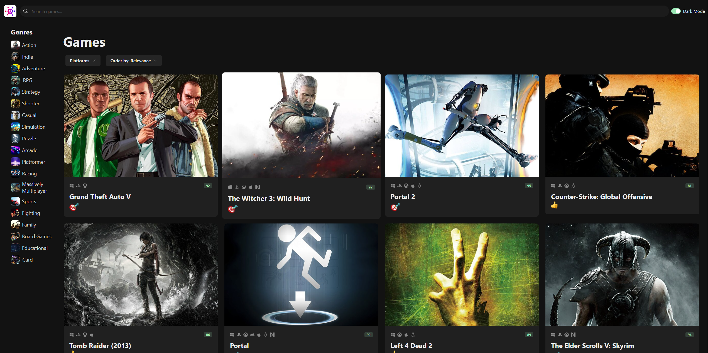
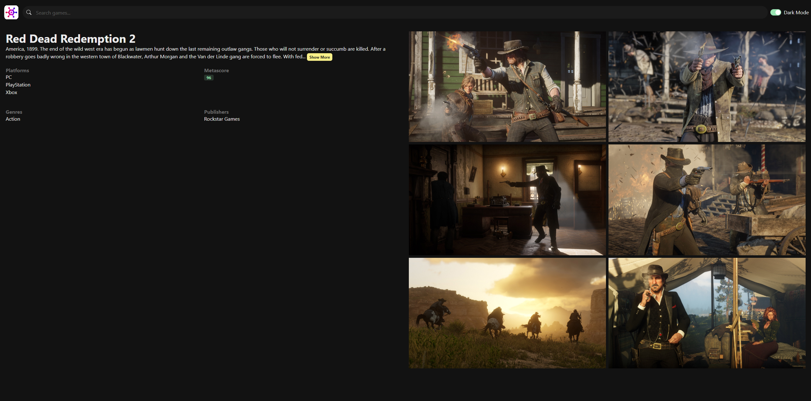

# Game Hub

[](https://game-hub-two-tau.vercel.app/)

**Game Hub** is a React-based web application that serves as a clone of [RAWG.io](https://rawg.io/). It utilizes the RAWG API to provide users with a rich database of video games, allowing them to explore, search, and filter games based on various criteria.

## Live Demo

Check out the live application here: [Game Hub](https://game-hub-two-tau.vercel.app/)

## Screenshots

Here are a few screenshots of the application:





## Features

- **Search Functionality**: Search for your favorite games using the powerful search feature.
- **Filter Functionality**: Filter games by genre or platform or both.
- **Sort Functionality**: Sort the games by Name, Date, Popularity, Relevance etc.
- **Dark Mode**: Switch easily between dark mode and light mode.
- **Game Details**: View detailed information about each game, including ratings, platforms, genres, and more.
- **Responsive Design**: Fully responsive design for an optimal user experience on both desktop and mobile devices.
- **API Integration**: Powered by the RAWG API to deliver real-time data on games.

## Installation

To run this project locally, follow these steps:

1. Clone the repository:

   ```bash
   git clone https://github.com/majshub/rawg-clone.git
   cd rawg-clone
   ```

2. Install the dependencies:

   ```bash
   npm install
   ```

3. Update the API key:

   Sign up on `rawg.io` and get an API key.

   Open the file `src/services/api-client.ts` and replace the existing API key with your own:

   ```javascript
   const axiosInstance = axios.create({
     baseURL: "https://api.rawg.io/api",
     params: {
       key: "your_rawg_api_key_here",
     },
   });
   ```

4. Start the development server:

   ```bash
   npm run dev
   ```

   The application should now be running on `http://localhost:3000`.

## Technologies Used

- **React**: A JavaScript library for building user interfaces.
- **Chakra UI**: A simple, modular, and accessible component library for React.
- **Bootstrap**: A popular front-end framework for developing responsive and mobile-first websites.
- **Vite**: A fast build tool and development server for modern web projects.
- **RAWG API**: A free and open video game database API.
- **Vercel**: Deployment platform for modern web projects.

## Contributing

Contributions are welcome! If you'd like to contribute, please fork the repository and use a feature branch. Pull requests are warmly welcomed.

## Contact

For any questions, feel free to reach out:

- **GitHub:** [majshub](https://github.com/majshub)
